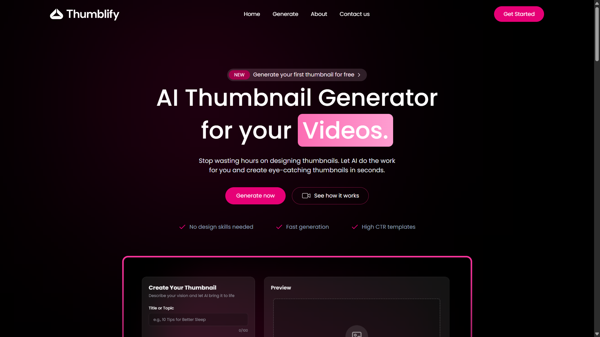
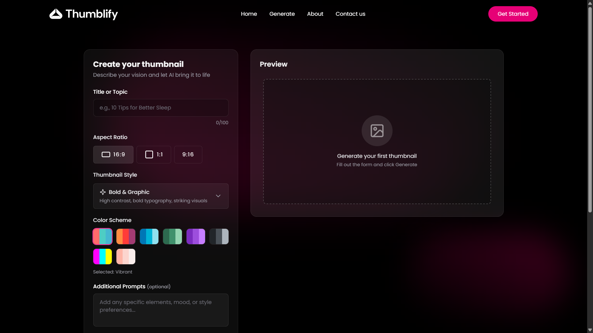
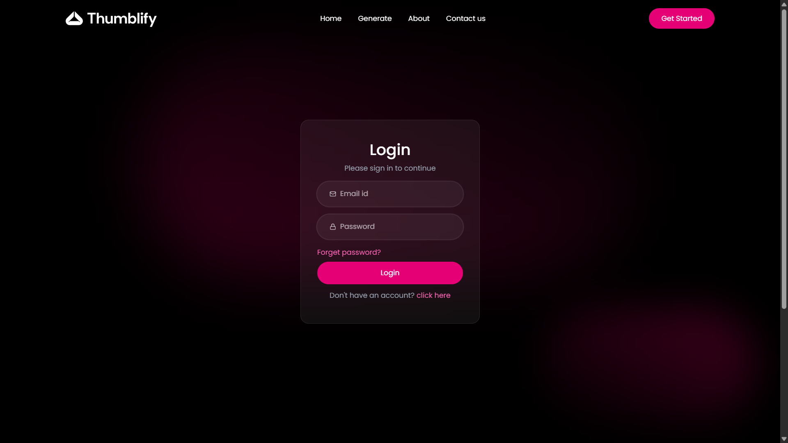
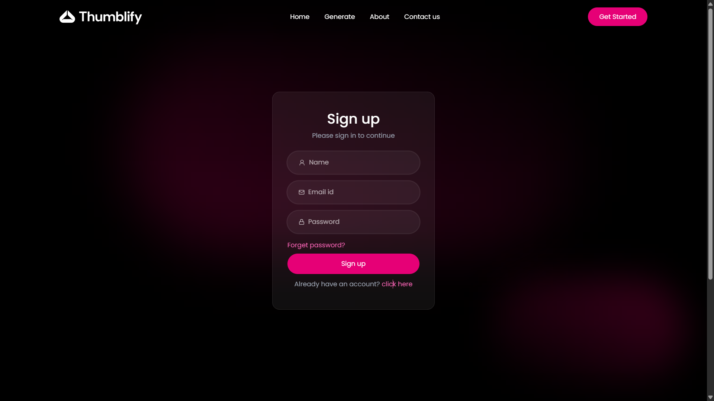
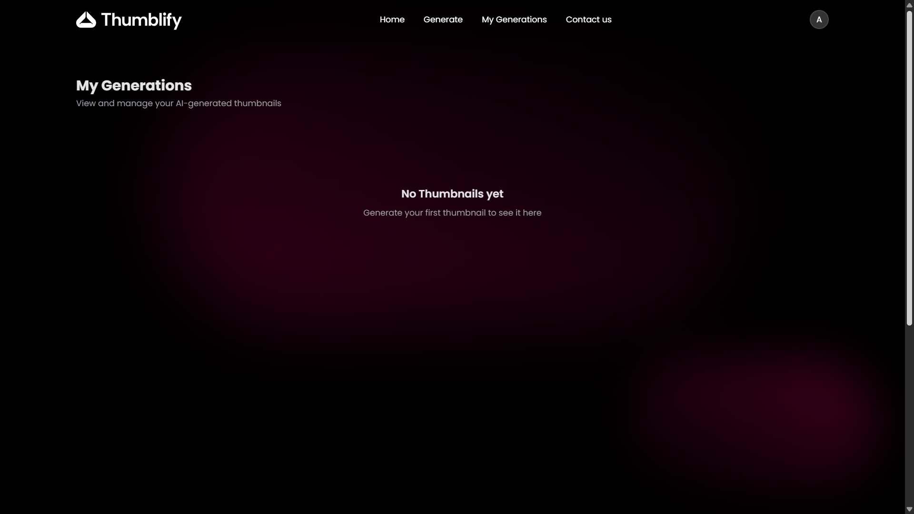

# 🎨 Thumblify – AI Thumbnail Generator (Gemini + MERN)

Thumblify is a **Generative AI powered thumbnail generator** that creates thumbnails based on user requirements using **Google Gemini API**.  
Users can generate thumbnails instantly and **download them after generation**.

🌐 **Live Demo:** https://thumblify-psi.vercel.app/

---

## ✨ Key Features

- 🤖 **AI Thumbnail Generation** using **Google Gemini API**
- 📝 Generate thumbnails based on user prompts/requirements
- ⬇️ **Download thumbnail** after generation
- 🔐 Authentication system (**Login / Signup**)
- 📂 **My Generations** page to manage generated thumbnails
- 📱 Responsive and modern UI
- ⚡ Fast performance with optimized full-stack flow

---

## 🛠 Tech Stack Reminder

### Frontend (Client)
- React.js + TypeScript
- Tailwind CSS
- Vite

### Backend (Server)
- Node.js
- Express.js
- MongoDB
- Google Gemini API (Generative AI)

---

## 📂 Project Structure

```bash
Thumblify/
│── client/       # Frontend (React + TypeScript)
│── server/       # Backend (Node + Express + MongoDB)
│── assets/       # Screenshots for README
│── .gitignore
│── README.md
```

---

## ⚙️ Setup & Installation

### 1️⃣ Clone the Repository

```bash
git clone https://github.com/Ayushman9889/Thumblify.git
cd Thumblify
```

---

## ▶️ Run Frontend (Client)

```bash
cd client
npm install
npm run dev
```

Frontend will run on:  
📍 `http://localhost:5173`

---

## ▶️ Run Backend (Server)

```bash
cd server
npm install
npm run dev
```

Backend will run on:  
📍 `http://localhost:5000` (or your configured port)

---

## 🔑 Environment Variables

Create a `.env` file inside **server/** folder:

```env
PORT=5000
MONGO_URI=your_mongodb_connection_string
JWT_SECRET=your_jwt_secret_key
GEMINI_API_KEY=your_gemini_api_key
```

✅ Replace the values with your own credentials.

---

## 🚀 How It Works

1. User enters thumbnail requirements (prompt)
2. Request goes to backend API
3. Backend uses **Gemini API** to generate the thumbnail
4. Generated thumbnail is returned to frontend
5. User can **download the thumbnail instantly** ✅

---

## 📸 Screenshots

### 🏠 Home Page


### 🎨 Generate Page


### 🔐 Login Page


### 📝 Signup Page


### 📂 My Generations Page


---

## 🚀 Deployment

This project is deployed on **Vercel** ✅  
Frontend Live Link: https://thumblify-psi.vercel.app/

---

## 🤝 Contributing

Contributions are welcome!

1. Fork this repository  
2. Create a new branch (`feature/new-feature`)  
3. Commit your changes  
4. Open a Pull Request ✅  

---

## 👨‍💻 Author

**Ayushman**  
GitHub: https://github.com/Ayushman9889

---

## ⭐ Support

If you found this project helpful, please give it a ⭐ on GitHub!
